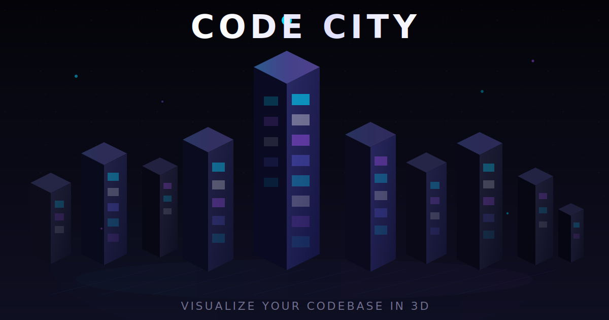

<a id="top"></a>

<div align="center">

# Codebase City

### Your codebase as a living 3D city.

Visualize any repository as an interactive city where files become buildings, folders become districts, and complexity becomes skyline height.

[](https://codebasecity.vercel.app)
[](LICENSE)
[](https://github.com/YashwanthKamireddi/CodebaseCity/pulls)



</div>

## Why Codebase City

Codebase City gives you spatial intuition for architecture:

- See hotspots instantly: tall and red buildings signal complexity and churn.
- Understand modular boundaries using district clustering.
- Explore dependency roads to locate coupling and critical paths.
- Inspect any building for metrics, symbols, imports, and source.

## Quick Start

```bash
git clone https://github.com/YashwanthKamireddi/CodebaseCity.git
cd CodebaseCity/frontend
npm install
npm run dev
```

Open http://localhost:5173 and analyze:

- A public GitHub repo URL
- A local folder (Chrome/Edge File System Access API)
- The built-in demo city

## Requirements

- Node.js 20+
- npm 10+
- Modern browser (Chrome/Edge recommended for local folder analysis)

## Project Structure

```text
CodebaseCity/
├── README.md
├── vercel.json
└── frontend/
    ├── public/
    │   ├── demo-city.json
    │   └── tree-sitter-grammars/
    ├── src/
    │   ├── engine/           # Parsing, graph, layout, worker analysis
    │   ├── entities/         # Building model + UI panels
    │   ├── features/         # AI architect, search, timeline, explorer, reports
    │   ├── shared/           # Shared UI, animations, toasts
    │   ├── store/            # Zustand slices and tests
    │   ├── styles/           # Design tokens + UI systems
    │   └── widgets/          # 3D viewport, city scene, roads, camera, effects
    ├── package.json
    └── vite.config.js
```

## Scripts

Run from frontend/:

```bash
npm run dev           # Start local dev server
npm run build         # Production build
npm run preview       # Preview production build
npm run lint          # Lint with ESLint
npm run test          # Vitest watch mode
npm run test:run      # Vitest single run
npm run test:coverage # Vitest coverage
```

## Deployment

### Deploy to Vercel

This repo already includes root-level vercel.json configured to build frontend/.

```bash
# from repo root
npm install
npx vercel login
npx vercel link
npx vercel --prod
```

If you prefer dashboard-based setup:

1. Import the GitHub repository in Vercel.
2. Keep root directory as repository root.
3. Vercel will use vercel.json automatically.

### Deploy to Any Static Host

```bash
cd frontend
npm install
npm run build
```

Upload frontend/dist to Netlify, Cloudflare Pages, GitHub Pages, or any static host.

## Environment Variables

Create frontend/.env.local for local development:

```bash
VITE_GEMINI_API_KEY=your_key_here
VITE_ANALYTICS_DOMAIN=your-domain.example
```

Notes:

- AI Architect requires a Gemini API key.
- Analytics is optional.

## Keyboard Shortcuts

- Click: Select and inspect a building
- Scroll: Zoom camera
- Drag: Orbit camera
- Right-drag: Pan camera
- Ctrl+K or Cmd+K: Open command palette
- L: Toggle district labels
- D: Toggle dependency roads
- V: Toggle 3D/table view
- Esc: Deselect/close modes

## Troubleshooting

### Blank Screen or Stale Bundles

```bash
cd frontend
rm -rf node_modules/.vite
npm install
npm run dev
```

### Build Verification

```bash
cd frontend
npm run build
```

## Contributing

```bash
git clone https://github.com/YOUR_USERNAME/CodebaseCity.git
cd CodebaseCity/frontend
npm install
npm run dev
```

Then create a branch, commit, push, and open a pull request.

## Roadmap

- Tree-sitter AST parsers for deeper language analysis
- Coverage overlays and PR diff visualization
- Multiplayer walkthrough mode
- Mobile touch-first navigation refinements
- VS Code extension integration

## License

MIT © 2026 Yashwanth Kamireddi

[Back to top](#top)
