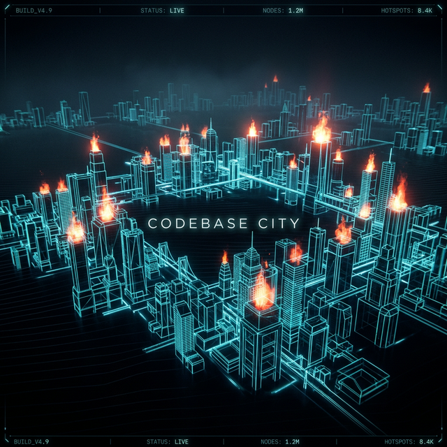
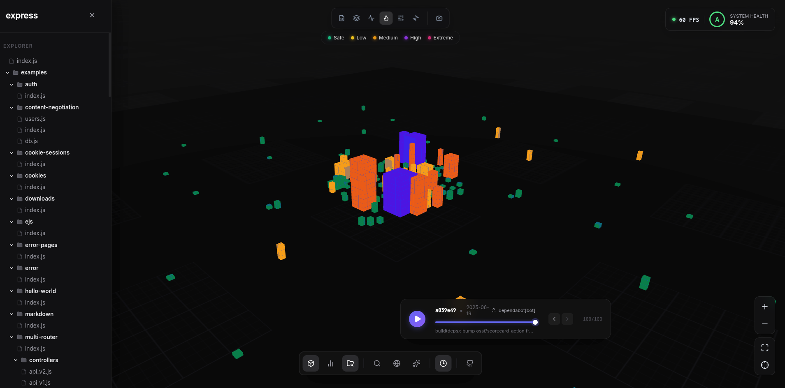
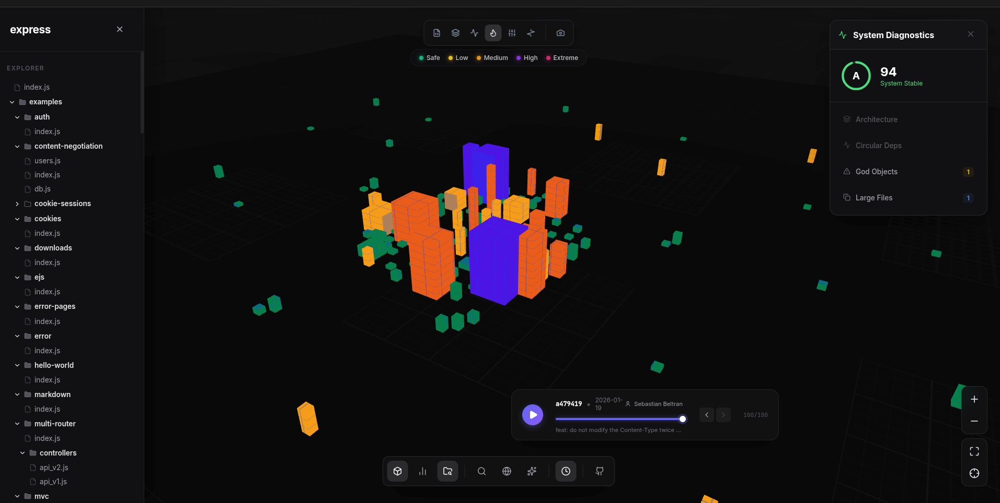
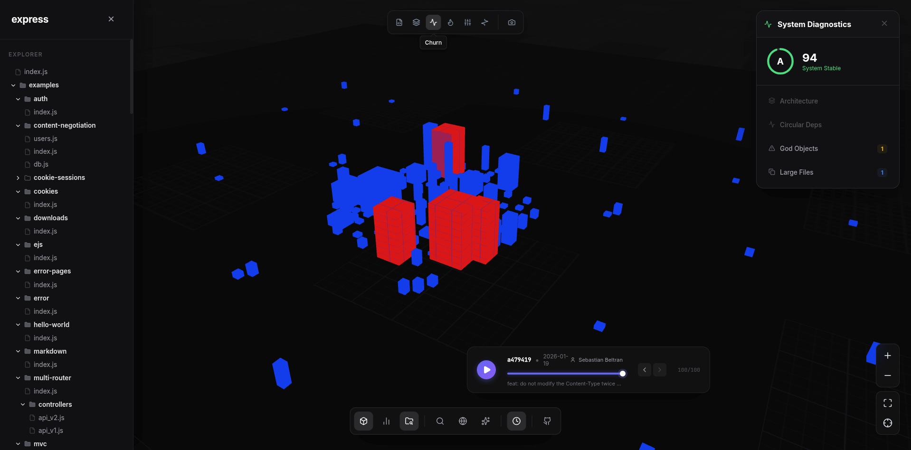
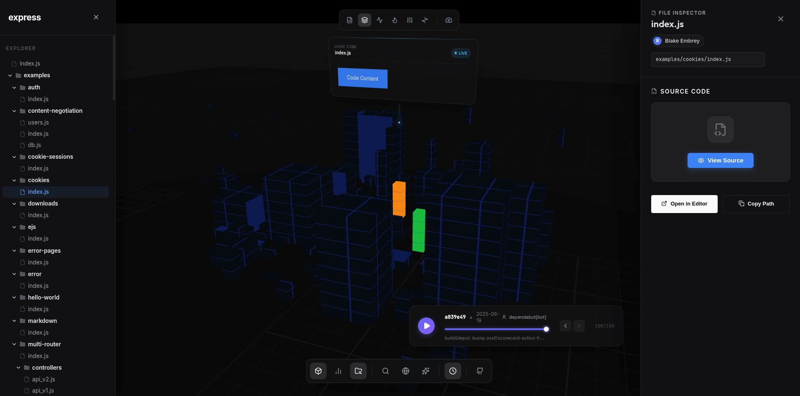

<div align="center">



# Codebase City

### See your code. Like never before.

**The open-source 3D architecture visualization engine that transforms any codebase into an explorable city.**

[](https://codebasecity.vercel.app)
[](https://github.com/YashwanthKamireddi/CodebaseCity)
[](LICENSE)

[](https://react.dev)
[](https://threejs.org)
[](https://fastapi.tiangolo.com)
[](https://tree-sitter.github.io)
[](https://python.org)
[](https://docker.com)

<br />

**Files become buildings. Folders become districts. Dependencies become roads.**<br />
Height = complexity. Color = health. You don't read the architecture — you *walk through it*.

<br />

[Try Live Demo](https://codebasecity.vercel.app) · [Report Bug](https://github.com/YashwanthKamireddi/CodebaseCity/issues) · [Request Feature](https://github.com/YashwanthKamireddi/CodebaseCity/issues) · [Discussions](https://github.com/YashwanthKamireddi/CodebaseCity/discussions)

</div>

<br />

<div align="center">
<table>
<tr>
<td></td>
<td></td>
</tr>
<tr>
<td align="center"><b>3D City Overview</b> — Every file is a building</td>
<td align="center"><b>Deep Inspection</b> — Click any building to X-ray its internals</td>
</tr>
<tr>
<td></td>
<td></td>
</tr>
<tr>
<td align="center"><b>Dependency Roads</b> — Glowing connections between imports</td>
<td align="center"><b>Time Travel</b> — Replay git history, watch the city grow</td>
</tr>
</table>
</div>

---

## Why Codebase City?

Static analysis tools give you numbers. Code review gives you diffs. **Codebase City gives you spatial understanding.**

Instead of reading a report that says *"auth.py has cyclomatic complexity 47"*, you see a towering red skyscraper in the center of the city and immediately understand:
- It's coupled to everything (roads everywhere)
- It's the oldest building (dark color)
- Changing it would break half the city (blast radius)

> **"The best way to understand a codebase is to see it."**

### Who is this for?

| Role | Use Case |
|------|----------|
| **Tech Leads** | Spot god-objects, circular dependencies, and tech debt at a glance |
| **New Engineers** | Spatially explore unfamiliar codebases during onboarding |
| **Architects** | Visualize blast radius before refactoring — simulate changes before writing code |
| **Open Source Maintainers** | Understand contribution patterns and codebase evolution over time |

---

## Features

### 🏙️ 3D Code Visualization
- **Complexity Mapping** — Building height = cyclomatic complexity, width = dependency count
- **Health Coloring** — Green (healthy) → Yellow (warning) → Red (critical) gradient
- **District Clustering** — Leiden algorithm groups related files into organic neighborhoods
- **GPU Instanced Rendering** — Handles 10,000+ files at 60 FPS

### 🔬 Architectural X-Ray
- **Click any building** → See classes, functions, imports, exports, LOC, complexity
- **Blast Radius** → Select a file and see exactly which modules break if you change it
- **Dependency Tracing** → Glowing neon roads between imports/exports
- **Inline Code Viewer** → Read source code without leaving the city

### 🔄 Refactoring Simulator
- **Drag-and-drop dry run** — Move a building to a different district, see what breaks *before writing code*
- **Real-time stability score** — Instant calculation of blast radius and encapsulation risks

### ⏰ Git Time Travel
- **Timeline scrubber** — Slide through commit history and watch the architecture evolve
- **Author Attribution** — See who built what (Gravatar-powered avatars floating above buildings)
- **Churn Detection** — High-churn files glow as hotspots

### 🤖 AI Architect (Gemini)
- Ask *"What are the most coupled modules?"* → Get an instant visual answer
- Ask *"Is this codebase well-structured?"* → Get AI-powered architecture review
- Context-aware — knows which building you're looking at

### 🔐 GitHub Integration
- **OAuth Login** → Analyze private repositories securely
- **1-Click Repo Select** → Browse your repos and analyze any of them
- **Ephemeral Parsing** → Source code is never stored — parsed and deleted immediately

### 🎮 Exploration Mode
- **WASD fly-through** — Navigate the city in first-person like a game
- Press **F** to enter, **Esc** to exit

### 🔍 Command Palette
- **⌘K / Ctrl+K** → Search files, symbols, and commands instantly

### 📊 Export
- **PDF/HTML Reports** — Download your architecture analysis

### 🧩 VS Code Extension
- **Bidirectional sync** — Click a building → opens file in VS Code. Hover in VS Code → highlights building in city
- **Right-click any folder** → "Analyze in Codebase City"

### 🤖 MCP Server
- Connect to **Claude**, **Cursor**, or any MCP-compatible AI agent
- Run Cypher queries against the AST/dependency graph
- Calculate blast radius from AI conversations

---

## Quick Start

### Option 1: Docker (Recommended)

```bash
git clone https://github.com/YashwanthKamireddi/CodebaseCity.git
cd CodebaseCity
cp backend/.env.example backend/.env  # Add your GEMINI_API_KEY
docker compose up
```

Open **http://localhost:5173** → Paste any GitHub URL or local path → Explore.

### Option 2: Manual Setup

**Prerequisites:** Node.js 18+, Python 3.11+, Git

```bash
# Backend
cd backend
python -m venv venv && source venv/bin/activate
pip install -r requirements.txt
cp .env.example .env  # Add your GEMINI_API_KEY
uvicorn main:app --reload --port 8000

# Frontend (new terminal)
cd frontend
npm install
npm run dev
```

Open **http://localhost:5173**

### Option 3: VS Code Extension

1. Install the extension from the `vscode-extension/` folder
2. Open any project → `Ctrl+Shift+C` → Your city appears in the browser
3. Click buildings ↔ files sync bidirectionally

---

## How It Works

```
┌──────────────────────────────────────────────────────────────────┐
│  YOUR CODEBASE                                                    │
│  (GitHub URL, local path, or VS Code workspace)                   │
└─────────────────────────┬────────────────────────────────────────┘
                          │
                    ┌─────▼─────┐
                    │  BACKEND   │
                    │  FastAPI   │
                    └─────┬─────┘
                          │
          ┌───────────────┼───────────────┐
          │               │               │
    ┌─────▼─────┐  ┌──────▼──────┐ ┌──────▼──────┐
    │ Tree-sitter│  │  NetworkX   │ │  GitPython  │
    │ AST Parser │  │ Dependency  │ │  History    │
    │            │  │ Graph       │ │  Analyzer   │
    └─────┬─────┘  └──────┬──────┘ └──────┬──────┘
          │               │               │
          └───────────────┼───────────────┘
                          │
                    ┌─────▼─────┐
                    │  Leiden    │
                    │ Clustering │ → Districts
                    │ + Voronoi  │ → Boundaries
                    │ + Spiral   │ → Building positions
                    └─────┬─────┘
                          │
                    ┌─────▼─────┐
                    │ FRONTEND   │
                    │ React +    │
                    │ Three.js   │ → 3D City in your browser
                    └───────────┘
```

**Pipeline:** Discovery → AST Parsing → Git Metadata → Graph Building → Clustering → Layout → City JSON → GPU Rendering

---

## Architecture

| Layer | Technology | Purpose |
|-------|-----------|---------|
| **3D Engine** | Three.js, React Three Fiber, custom GLSL shaders | GPU-instanced city rendering at 60 FPS |
| **Frontend** | React 18, Zustand, Framer Motion, D3.js, GSAP | Reactive UI with cinematic animations |
| **Backend** | FastAPI, Python 3.11, Pydantic v2, Uvicorn | High-performance async REST API |
| **Parsing** | Tree-sitter (Python, JS, TS) | Production-grade AST extraction |
| **Graph** | NetworkX, Leiden algorithm, KuzuDB | Dependency analysis + community detection |
| **AI** | Google Gemini API | Natural language architecture queries |
| **Auth** | GitHub OAuth, JWT | Secure private repo access |
| **Infra** | Docker, Vercel, GitHub Actions CI/CD | One-command deployment |
| **IDE** | VS Code Extension, WebSocket sync | Bidirectional file ↔ building navigation |
| **Agents** | MCP Server (Claude/Cursor compatible) | AI-powered architecture exploration |

---

## Environment Variables

```bash
# backend/.env
GEMINI_API_KEY=your_key_here          # Required — get free at https://aistudio.google.com/apikey
GITHUB_CLIENT_ID=                      # Optional — for private repo OAuth
GITHUB_CLIENT_SECRET=                  # Optional — for private repo OAuth
JWT_SECRET=change_me_to_random_string  # Optional — auto-generated if unset
```

---

## Keyboard Shortcuts

| Key | Action |
|-----|--------|
| **Click** | Select / inspect a building |
| **Scroll** | Zoom in / out |
| **Drag** | Orbit camera |
| **Right-drag** | Pan |
| **⌘K** | Command palette |
| **F** | Toggle exploration mode (WASD flight) |
| **L** | Toggle labels |
| **D** | Toggle dependency roads |
| **V** | Toggle 3D / table view |
| **Esc** | Deselect / exit mode |

---

## Supported Languages

| Full AST Parsing | Regex Fallback |
|-----------------|----------------|
| Python | Java, Go, Rust, C, C++, C# |
| JavaScript | PHP, Ruby, Swift, Kotlin |
| TypeScript | Scala, HTML, CSS, SQL |

---

## API Reference

<details>
<summary><b>Click to expand API endpoints</b></summary>

| Method | Endpoint | Description |
|--------|----------|-------------|
| `POST` | `/api/analyze` | Analyze a codebase (local paths, GitHub URLs, `owner/repo`) |
| `GET` | `/api/demo` | Load the demo city |
| `GET` | `/api/city/{id}` | Retrieve a cached city |
| `POST` | `/api/chat` | AI architect conversation |
| `POST` | `/api/search` | Semantic code search |
| `GET` | `/api/graph/{city_id}` | 2D dependency graph data |
| `GET` | `/api/history` | Git commit history |
| `GET` | `/api/files/content` | File content retrieval |
| `GET` | `/api/intelligence/health/{id}` | Code health report |
| `GET` | `/api/auth/github/login` | GitHub OAuth flow |
| `WS` | `/ws/vscode` | VS Code bidirectional sync |
| `WS` | `/ws/frontend` | Browser real-time updates |

Interactive docs available at `http://localhost:8000/docs` (Swagger UI)

</details>

---

## Deployment

### Vercel (Free — Recommended for demo)

The project has a pre-configured `vercel.json`:

```bash
npm i -g vercel
vercel --prod
```

### Railway (Free tier — Full backend with Git cloning)

For a persistent backend that can clone and analyze repos:

1. Push to GitHub
2. Connect your repo on [Railway](https://railway.app)
3. Set environment variables (`GEMINI_API_KEY`)
4. Auto-deploys on every push

### Docker (Self-hosted)

```bash
docker compose up -d
```

---

## Project Structure

```
CodebaseCity/
├── frontend/               # React + Three.js client
│   ├── src/
│   │   ├── widgets/        # 3D city viewport, layout, debug HUD
│   │   ├── features/       # Analysis, search, timeline, AI chat, explorer
│   │   ├── entities/       # Building panel, code viewer
│   │   ├── store/          # Zustand state (slices pattern)
│   │   ├── hooks/          # Camera, VS Code sync, virtual list
│   │   └── shaders/        # Custom GLSL building shader
│   └── public/
│       └── demo-city.json  # Pre-generated demo city
│
├── backend/                # FastAPI Python server
│   ├── api/                # REST routes + WebSocket endpoints
│   │   ├── routes/         # Analysis, chat, files, graph, auth, search, MCP
│   │   └── v2/             # V2 API (graph intelligence)
│   ├── parsing/            # Tree-sitter AST parser, metrics, search engine
│   │   ├── pipeline/       # Multi-step analysis pipeline
│   │   └── intel/          # Code health, dead code, impact, quality analysis
│   ├── graph/              # NetworkX, Leiden clustering, Voronoi layout, KuzuDB
│   ├── ai/                 # Gemini client, city guide, architecture advisor
│   ├── services/           # Git operations (clone, parse URLs, auth)
│   ├── core/               # Config, database (Redis + in-memory fallback)
│   ├── utils/              # Logger, middleware, rate limiter, security
│   └── mcp_server.py       # MCP server for AI agents (Claude/Cursor)
│
├── vscode-extension/       # VS Code extension (bidirectional sync)
├── docs/                   # Screenshots, architecture diagrams
├── scripts/                # Demo city generator, utilities
├── docker-compose.yml      # One-command deployment
├── vercel.json             # Vercel deployment config
└── .github/workflows/      # CI/CD (lint, test, build, security, deploy)
```

---

## Contributing

Contributions are welcome! Whether it's a bug fix, new language parser, UI improvement, or documentation — all contributions help.

```bash
# Fork → Clone → Branch
git checkout -b feature/your-feature

# Make changes, then:
git commit -m "feat: add your feature"
git push origin feature/your-feature

# Open a Pull Request on GitHub
```

**Ideas for contributions:**
- Add Tree-sitter grammars for more languages (Java, Go, Rust)
- Improve district clustering algorithms
- Add new color modes (by author, by age, by test coverage)
- Performance optimizations for 50K+ file repos
- Mobile / touch controls
- Multiplayer mode (explore the same city together)

---

## Roadmap

- [ ] Hosted public instance at codebasecity.dev
- [ ] Java, Go, Rust, C++ full AST parsing support
- [ ] Test coverage overlay — green/red buildings based on coverage
- [ ] PR diff visualization — see what changed between commits
- [ ] Multiplayer — share a city link and explore together
- [ ] VS Code Marketplace publication
- [ ] GitHub Action — auto-generate city on every PR

---

## Star History

If this project is useful to you, please consider giving it a ⭐

[](https://star-history.com/#YashwanthKamireddi/CodebaseCity&Date)

---

## License

MIT © 2026 [Yashwanth Kamireddi](https://github.com/YashwanthKamireddi)

---

<div align="center">

**[⬆ Back to top](#codebase-city)**

</div>
