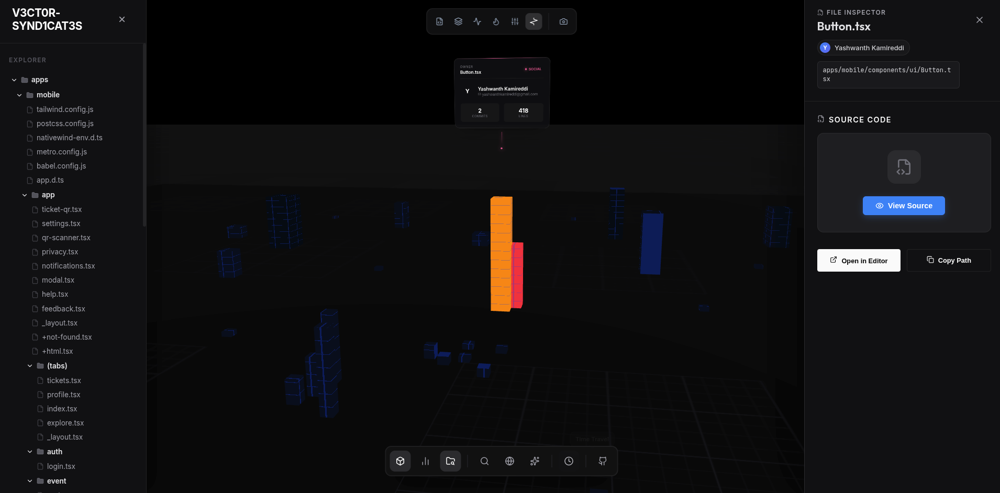
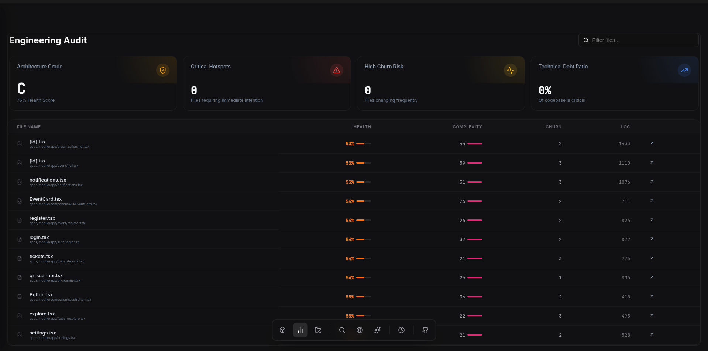

<div align="center">

# Codebase City

**Advanced 3D Visualization & Analytics Platform for Software Engineering.**

[](LICENSE)
[](#)
[](#license)

[Demo](#gallery) • [Features](#capabilities) • [Installation](#getting-started) • [Usage](#usage)

</div>

---

## Overview

**Codebase City** is a static analysis tool that renders software architecture as an interactive 3D environment. It parses abstract syntax trees (AST) and Git history to generate a spatial representation of code complexity, dependencies, and developer activity.

Primary use cases:
*   **Technical Debt Identification**: Visualizing complex files ("God Objects") as towering structures.
*   **Onboarding**: Allowing new engineers to spatially explore project layout and logic flow.
*   **Activity Tracking**: Replaying commit history to identify churn and ownership.

---

## Capabilities

### 1. Spatial Code Analysis
*   **Complexity Mapping**: File height correlates to LOC (Lines of Code) and cyclomatic complexity.
*   **Dependency Tracing**: Visual links show import/export relationships between modules.
*   **Hotspot Detection**: Color-coded indicators for files with high churn or error rates.

### 2. Temporal Visualization ("Cinematic Timeline")
*   **Git Replay**: Scrub through project history to watch architecture evolve.
*   **Author Attribution**: identifying active contributors via 3D avatars overlaid on modified files.
*   **Blame View**: Instant visibility of file ownership and last-modified dates.

### 3. Inspection & Diagnostics
*   **Deep Dive Inspection**: Click any node to view source code, syntax highlighting, and metrics.
*   **System Diagnostics**: Automated alerts for circular dependencies, large files, and potential refactoring targets.
*   **Universal Search**: Jump to any file, class, or function instantly.

---

## Gallery

<p align="center">
  
  
  
  
  
  
</p>

---

## Getting Started

### Prerequisites
*   **Node.js** v18 or higher
*   **Python** 3.11 or higher
*   **Git**

### Installation

Clone the repository and install dependencies for both services.

```bash
# 1. Clone Repository
git clone https://github.com/YashwanthKamireddi/CodebaseCity.git
cd CodebaseCity

# 2. Setup Backend (Analysis Engine)
cd backend
pip install -r requirements.txt
# Run the API server
python -m uvicorn main:app --reload --port 8000 &

# 3. Setup Frontend (Visualization Client)
cd ../frontend
npm install
# Run the client
npm run dev
```

The application will be available at `http://localhost:5173`.

---

## Usage

### Analyzing a Project
1.  **Launch the Dashboard**: Open the web interface.
2.  **Input Source**:
    *   **Local**: Enter the absolute path to a directory on your machine.
    *   **Remote**: Paste a valid GitHub repository URL.
3.  **Visual Exploration**: Use `WASD` or mouse controls to navigate the 3D city.
4.  **Inspect**: Click on any building to open the **File Inspector**.

### Keyboard Controls
*   `W`/`A`/`S`/`D`: Move Camera
*   `Q`/`E`: Rotate
*   `Scroll`: Zoom
*   `Cmd+K` / `Ctrl+K`: Open Command Palette / Search

---

## Contributing

Contributions are welcome. Please ensure all pull requests adhere to the project's coding standards and architecture patterns.

**Intellectual Property Notice**:
This project and its core architecture are the intellectual property of **Yashwanth Kamireddi**. Contributors agree that their submissions become part of the project under the standard MIT License terms.

---

## License

**Copyright © 2026 Yashwanth Kamireddi.** All Rights Reserved.

Licensed under the MIT License. See [LICENSE](LICENSE) for full text.
